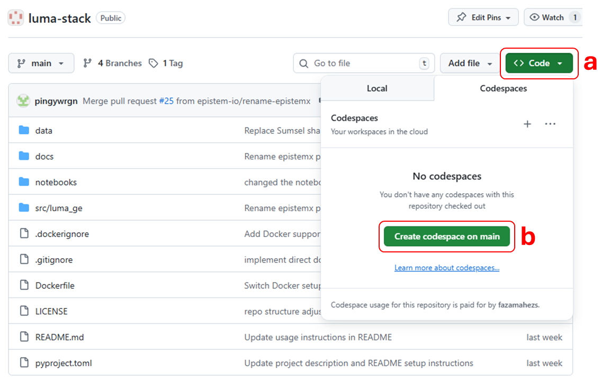

# Luma Geospatial Engine

[](https://www.python.org/downloads/) [](https://github.com/epistem-io/luma-stack/issues) [](https://github.com/epistem-io/luma-stack/pulls)

Land Use Mapping for All (Luma) is an online mapping platform that integrates open-source spatial data and cloud-based computing for generating land use and land cover (LULC) maps. Luma is designed to accommodate a wide range of users through its user-friendly interface and guided steps, enabling anyone to easily produce custom LULC maps tailored to their needs.

## Table of Contents

-   [Overview](#overview)
-   [Getting Started](#getting-started)
-   [Usage](#usage)
    -   [Quick Start Guide](#quick-start-guide)
    -   [Running Jupyter Notebooks](#running-jupyter-notebooks)
    -   [Running the Streamlit Application](#running-the-streamlit-application)
-   [Configuration](#configuration)
-   [Troubleshooting](#troubleshooting)
-   [Contributing](#contributing)
-   [License](#license)

## Overview {#overview}

Luma Geospatial Engine (Luma-ge) is a Python package that serves as the geospatial engine for the Luma platform. The system follows a structured 7-module pipeline:

1.  **Module 1**: Minimum Cloud Image Acquisition
2.  **Module 2**: Classification Scheme Definition
3.  **Module 3**: Sample Data Generation
4.  **Module 4**: Sample Data Quality Analysis
5.  **Module 5**: Feature Selection and Extraction
6.  **Module 6**: Land Cover Classification
7.  **Module 7**: Thematic Accuracy Assessment

### File Structure {#file-structure}

-   **`src/luma_ge/`**: The core Python package for this project. It contains all the backend logic, helper functions, and modules for interacting with Google Earth Engine.
-   **`notebooks/`**: Jupyter notebooks used for development, experimentation, and demonstrating the functionality of the core modules.
-   **`pyproject.toml`**: The standard Python project configuration file. It defines project metadata and core dependencies for `pip`.

## Getting Started {#getting-started}

Follow these instructions to set up and run the project on your local machine.

### 1. Prerequisites {#prerequisites}

Before you begin, ensure you have the following installed on your system:

#### System Requirements

-   **Git**: A version control system for cloning the repository. [Installation Guide](https://git-scm.com/book/en/v2/Getting-Started-Installing-Git).
-   **Python environment manager**: If you do not yet have one installed, we recommend [Miniforge](https://github.com/conda-forge/miniforge); it is lightweight, no-frills compared to Anaconda, and works well for this project. If you already have another Conda-compatible manager, you can continue using it.

To confirm these tools are available in your shell, run:

``` powershell
git --version
conda --version
```

**Warning for Windows Users: Do not add Python or Conda to your system PATH.** This causes conflicts and prevents the luma_ge environment from working correctly. For details, see [FAQ- Should I add Anaconda to the Windows PATH?](https://www.anaconda.com/docs/getting-started/working-with-conda/reference/faq#should-i-add-anaconda-to-the-windows-path).

#### Google Earth Engine Account

-   A free [Google Earth Engine account](https://earthengine.google.com/)
-   For service account authentication: A Google Cloud project with Earth Engine API enabled

### 2. Set Up the Python Environment

Choose one of the following setup methods based on your needs:

#### Option A: Install from Git

*Recommended for most users - install directly from the repository.*

**Direct install (no cloning required):**

``` bash
pip install git+https://github.com/epistem-io/luma-stack.git
```

**Or clone and install in editable mode:**

1.  Clone the repository:

    ``` bash
    git clone https://github.com/epistem-io/luma-stack.git
    cd luma-stack
    ```

2.  Install the package using pip:

    ``` bash
    pip install -e .
    ```

    This will install `luma_ge` and all its dependencies as specified in `pyproject.toml`.

3.  Usage:

    Launch Jupyter Lab to work with the notebooks:

    ``` bash
    jupyter lab
    ```

    Then open `notebooks/Module_implementation.ipynb` for a step-by-step guide on using the `luma_ge` modules.

#### Option B: Docker Container

*Best for deployment or isolated environments.*

1.  Build the Docker image:

    ``` bash
    docker build -t luma_ge .
    ```

2.  Run the container:

    ``` bash
    docker run -p 8888:8888 luma_ge
    ```

3.  Access Jupyter Lab at `http://localhost:8888` and open `notebooks/Module_implementation.ipynb` to start working with the modules.

#### Option C: GitHub Codespaces (Cloud-based, No Local Setup)

*Best for quick experimentation without local installation, or when working on different machines.*

1.  **Create a Codespace** from the repository:

    

    -   Navigate to the [luma-stack repository](https://github.com/epistem-io/luma-stack) on GitHub
    -   Click the green **Code** button (a)
    -   Select **Codespaces** tab → **Create codespace on main** (b)
    -   Wait for the environment to initialize (typically 2-3 minutes)

2.  **Start Working**:

    -   Open the `notebooks/Module_implementation.ipynb` file in VS Code's notebook editor within the Codespace.
    -   Choose the pre-configured Python environment (dependencies are already installed).
    -   Execute the cells to observe how individual modules function with their default settings and example inputs from the `/data` directory.
